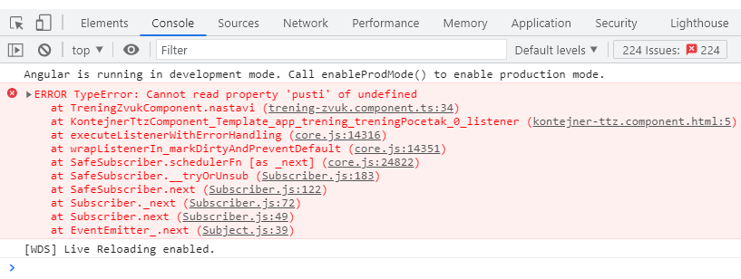

# Prezentacija projekta: https://bolo-med.github.io/dribbling-workout/

### 10-minutni košarkaški trening za dribling

Trening se sastoji od nekoliko vježbi, različitog trajanja, i tri pauze. Korisnik može da pauzira i nastavlja trening, i da prati preostalo vrijeme treninga, kao i preostalo vrijeme vježbe uz progres bar.

Na glavnom dijelu je prikazan naslov trenutne vježbe, ilustracija (slika) izvođenja vježbe, a u toku pauze je prikazan naslov sledeće vježbe. Sa strana su opis vježbe i video snimci izvođenja vježbe.

Tokom treninga se čuje odgovarajuća zvučna signalizacija.

**PROBLEM**: U komponenti *TreningComponent* se odmah aktivira događaj, posle koga se poziva f-ja iz komponente *TreningZvukComponent*, i to prije nego što se inicijalizuju njene promenljive.

